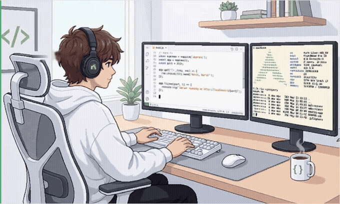

  

  

    I build reliable AI agents, from tool orchestration and evaluation 
    to high-performance LLM serving.
  

  

    <code>Runtime</code>
    <code>Tools</code>
    <code>Evaluation</code>
    <code>Serving</code>
  

  
    M.S. in Computer Science @ Zhejiang Normal University · Graduating 2027 · Open to opportunities
  

 

  <picture>
    <source media="(prefers-color-scheme: dark)" srcset="./assets/hazy-pixel-art-dark.gif"/>
    <source media="(prefers-color-scheme: light)" srcset="./assets/hazy-pixel-art-light.gif"/>
    
  </picture>

## What I Build

- **Production AI Agents** — evidence-driven workflows, tool orchestration, retrieval, structured evaluation, and failure recovery.
- **Agent Platforms** — sandbox runtimes, streaming events, asynchronous jobs, observability, and long-running task reliability.
- **LLM Systems** — vLLM scheduling, KV-cache-aware serving, quantized deployment, speculative decoding, and GPU performance analysis.

## Selected Work

| System | What I worked on |
| --- | --- |
| **Argus & Alice** | Production AIOps agent and enterprise agent platform: evidence-based RCA, sandbox runtime, streaming orchestration, evaluation, and reliability. |
| [**DBOps Enterprise Copilot**](https://github.com/xuhuan51/dbops-enterprise-copilot) | A LangGraph Text-to-SQL agent with hybrid schema retrieval, graph-based join planning, SQL verification, and observable Kubernetes delivery. |
| [**LLM Serving Stack**](https://github.com/xuhuan51/llm-serving-stack) | Reproducible serving experiments covering vLLM scheduling, KV/prefix cache behavior, Qwen3 deployment, SLO analysis, and GPU topology. |
| [**DSpark Serving Benchmark**](https://github.com/xuhuan51/dspark-spec-serving-benchmark) | Speculative-decoding evaluation across models, quantization modes, concurrency levels, and adaptive runtime selection. |

## Open Source

- [vLLM #51384](https://github.com/vllm-project/vllm/pull/51384) — bounded session-affinity scheduling for multi-turn workloads.
- [vLLM #51381](https://github.com/vllm-project/vllm/pull/51381) — session identity propagation for KV Events.

## Working With

`Python` · `C++` · `CUDA` · `LangGraph` · `FastAPI` · `vLLM` · `Qwen3` · `Docker` · `Kubernetes` · `Prometheus`

  
    From agent loops to GPU kernels. 
    Pixel animation from
    <a href="https://github.com/Hazy019/hazy-readme-cards">Hazy Readme Cards</a>,
    used under the MIT License.
  

